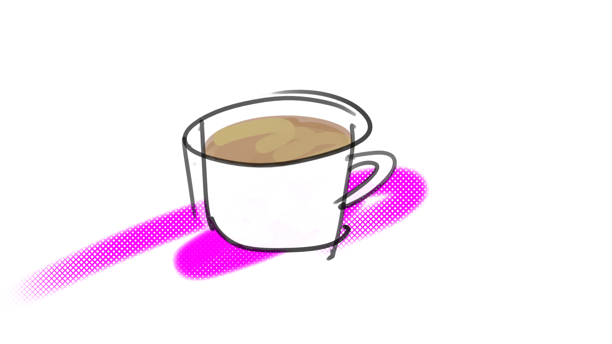

I don’t drink coffee because it makes me productive.

I drink coffee because it splits my head wide open.

Productivity is merely a byproduct.

Glorious excess.

Profligate expenditure.

I started drinking coffee as a teenager and by my mid-twenties I was downing four to six cups every morning and following up with a double espresso in the afternoon.

The dentist, smelling it oozing out of my pores, implored, “You should cut back on coffee”.

I’m lucky I didn’t grind my teeth to nubs in my sleep.

You know what I loved more than anything?

Coffee with a cigarette.

Breakfast of champions.

I know.

I got older.

Somewhat wiser.

I still struggle.

Let me break it down in a table...

| CONS                                          | PROS              |
| ----                                          | ----              |
| It’s an unnecessary luxury.                   | It’s delicious.   |
| It makes me shit a lot.                       | I feel smart.     |
| It makes me an irritable, impatient asshole.  | I get shit done.  |
| It gives me bad breath.                       | It’s communal.    |
| It keeps me up at night.                      | I love it.        |

Some relationships are more challenging than others.

## The Good

Coffee drinkers are a fervent flock.

If you’re desperate for a ‘Like’, throw up a post about coffee.

Every few months or years a study is released extolling the health benefits of coffee and the Internet is abuzz with the sound of jittery, self-congratulatory back-patting.

With a healthy habit, coffee drinkers can expect these benefits:

* A pantload of antioxidants
* Decrease in risk for type 2 diabetes
* Decrease in risk for heart disease
* Decrease in risk for Parkinson’s
* Decrease in risk for liver cirrhosis for boozehounds
* Decrease in risk for Alzheimer’s and dementia
* Decrease in risk for stroke
* Reduced depression in those prone to it

You don’t have to be a bean counter to see that coffee keeps you in the black.

## The Bad

As in the Gray Lady, which so often accompanies the ingestion of coffee, it’s not all good news.

Caffeine causes us to produce cortisol, the same hormone associated with our stress response.

If you’re a coffee drinker and you work a stressful job, you can kiss those health benefits listed above goodbye.

For those with delicate constitutions or heavy consumers, coffee can raise the acid level of your stomach, tipping the balance of your microbiome, which can lead to ulcers, acid reflux, and inflammation.

Bugs.

The theory is that plants evolved caffeine as a pesticide.

It’s a psychoactive.

It disrupts the nervous systems of insects.

It splits their heads wide open in a bad way.

Caffeine is poison for humans, too.

Your liver kicks into emergency mode to break it down.

Unlike alcohol, which can be flushed out through respiration and hydration, caffeine stays in your body until your liver does its thing.

Be good to your liver.

You’re going to need it to so you can enjoy the benefits of coffee in your golden years.

The half-life of caffeine is around 6 hours for the average human.

Your body soaks it up like a sponge.

It spreads everywhere.

Including your bodily fluids.

Including semen and breast milk.

I know where your mind just went.

Lattes.

As long as your mind is in the gutter, let’s talk about the environmental impact of coffee production.

Coffee plants evolved in the jungle under the tree canopy.

Enterprising agriculturists discovered that if you cut down the trees, you can grow more coffee.

I know you need coffee, but we need trees even more.

They are the lungs of the planet.

Let’s not encourage their cutting.

Maybe you’ve heard of shade grown coffee?

It’s not for snobs.

It’s coffee that is harvested from plants interspersed among the trees of a forest.

It’s easier to propagate without pesticides because the birds and beasts of the forest eat the pests that eat coffee plants.

Fern Gully.

## The Badass

The primary goal of Fork Yeah! is to make you smart AF (As Fork).

A byproduct of using your brain is the chemical adenosine.

Your body produces adenosine to prevent your brain from frying itself.

It regulates your neurons.

When your neurons fire, adenosine is produced.

More firing, more adenosine.

Adenosine fills your skull until it binds to receptors on your neurons and tells them to chill the fuck out in no uncertain terms.

You will start to feel sleepy.

And when you sleep, the adenosine is released from the receptors and your neurons rev their engines for another full day of firing.

Caffeine is very similar in structure to adenosine.

When you drink coffee, caffeine blocks the adenosine receptors, preventing you from feeling sleepy and allowing your brain to rocket to the moon.

But don’t think drinking more coffee will make more neurons fire.

There’s a sweet spot for caffeine consumption, and you’ve probably found it.

Studies show that when a certain threshold is crossed, caffeine will stimulate the production of a range of chemicals that have the opposite effect and will make you feel depressed.

Don’t fly too close to the sun.

Stay grounded.

On this planet.

How much caffeine is healthy?

Figure 1mg per pound of body weight.

The standard 12 oz. cup of coffee contains approximately 150mg of caffeine.

I weigh roughly 150 pounds, so that’s my limit.

Do I stay within it?

Rarely.

So you’re a coffee drinker. You can’t let it go. Not only is it a part of your identity, your brain and bowels depend on it.

You wear a bracelet:

In case of emergency, IV 400mg caffeine. Otherwise, do not resuscitate.

We speak the same language.

Just like the fuel pump, there are three octanes, or waves, of coffee.

## Coffee Waves

The first wave is the crap our parents drank, and maybe still drink. Diner coffee, garage coffee. Sludge. Think Folgers, Maxwell House, Juan Valdez. Black sawdust in big cans. The only thing good about first wave is the cans for use as budget urns.

The second wave is the coffee shop (often a chain) offering a selection of roasts and espresso-based drinks. Think Starbuck’s, Peet’s, Coffee Bean & Tea Leaf. The best part about second wave coffee is the access to restrooms their shops provide in big cities.

The third wave emphasizes single-origin, fair trade coffee prepared using apparati best suited to the bean. If this concept is new to you, perhaps you’ve heard of Intelligentsia or Blue Bottle. They have national name recognition, but the list of third wave roasters is epic, and really, Intelligentsia and Blue Bottle are no longer where it’s at. I’m currently finding [Passenger](https://www.passengercoffee.com/) spot on.

There’s a fourth wave on the horizon.

Get your board.

If you’re going to do it, drink third wave coffee. Don’t step down the evolutionary ladder.

As Wikipedia states, third wave coffee is considered an “artisanal foodstuff”.

Your body is an artisanal foodstuff.

For bears and sharks.

Only the finest fuel for our high performance machinery.

Keep that brain well-oiled.

Add coconut oil to your coffee.

## Vegan Bulletproof Coffee

Are you coffee/caffeine sensitive, like me? Looking to take it to the next level?

Make _Impervious Coffee_.

Heard of Bulletproof?

It’s good, but it uses butter.

Which is not vegan and makes me break out.

It’s also a registered trademark.

So I’m referring to this vegan coffee recipe as _impervious_.

I’m not going to trademark it, but that doesn’t mean you should.

Dave Asprey ‘discovered’ Bulletproof Coffee. He uses it, among other questionable activities, to hack his body for career success and longevity.

That’s cool.

But our aims here are both selfish and selfless.

While a lot of Asprey’s claims are dubious, my experience is that binding my morning coffee with fats mitigates both mid-morning crash and that ol’ hangry feeling, which results in sustained focus throughout the day.

It’s also fucking delicious.

The Bulletproof takeaway? If you’re a coffee drinker, don’t eat carbs for breakfast. They only make things worse. Donuts are an infinite loop of failure. You need to ingest fats and protein so your body has something substantial to burn.

That’s why you feel so awesome after a weekend brunch.

It’s not the Mimosas or Mary’s.

Your stomach is like a fire. If you throw a heap of shit on it, it’s going to smoulder.

But feed it a log and you will burn bright!

Set yourself up for success.

### Ingredients

* High quality beans (shade-grown, fair-trade, wet-processed, organic preferred)
* Coconut butter, or manna
* Walnut or hemp oil (optional)

### Equipment

* Your preferred method for brewing coffee. I use a [hand-cranked burr grinder](https://amzn.to/2TbGYLm) and a [porcelain filter cone](https://amzn.to/2GTmyQV) with [unbleached filters](https://amzn.to/2C19CV8)
* Blender
* Measuring spoons (optional)

### Procedure
1. Grind, then brew the beans
2. While the coffee percolates, measure into the blender:
  * 1-2 T coconut butter (or eyeball it)
  * 1-2 t walnut or hemp oil (or guesstimate)
3. When ready, blend the coffee with the ingredients in the blender for 30-60 seconds.

Fork Yeah!

_Fork this recipe on [GitHub](https://github.com/nielsenjared/forkyeah/blob/master/recipes/coffee.md)_

_Disclaimer: Amazon links are affiliate._
